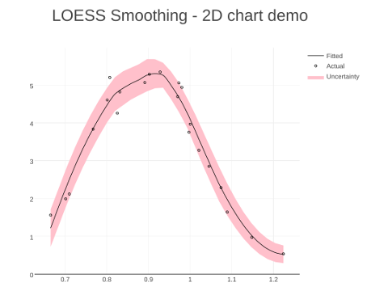
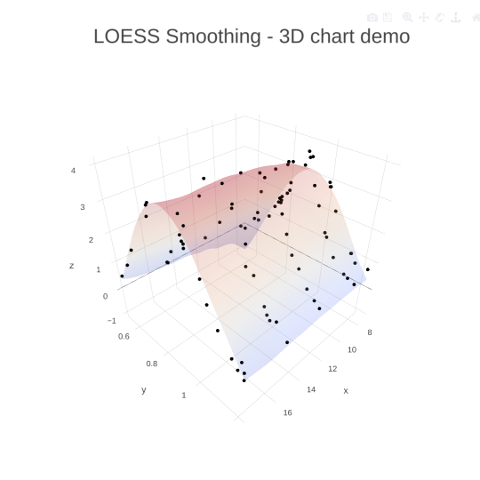

# loess

JavaScript implementation of the Locally-Weighted Regression package originally written in C by Cleveland, Grosse and Shyu (1992)

## Getting started

First install the package:
```
npm install loess --save
```

Load in your data:
```javascript
var data = require('./myData.json')
```

Instantiate a LOESS model with the data:
```javascript
var Loess = require('loess')
var options = {span: 0.5, band: 0.8, degree: 1}
var model = new Loess(data, option)
```

Fit model by calling the **.predict( )** method on the model object:
```javascript
var fit = model.predict()
console.log(fit.fitted)
// do something else with fit.fitted
```

To fit model on a new set of points, pass a data object into **.predict( )**
```javascript
var newData = {
  x: [1, 2, 3, 4, 5],
  x2: [6, 7, 8, 9, 10]
}

fit = model.predict(newData)

var upperLimit = fit.fitted.map((yhat, idx) => yhat + fit.halfwidth[idx])
var lowerLimit = fit.fitted.map((yhat, idx) => yhat - fit.halfwidth[idx])
// plot upperLimit and lowerLimit
```

Alternatively, use **.grid( )** method to generate a grid of equally spaced points:
```javascript
newData = model.grid([20, 20])

fit = model.predict(newData)
```

***

## Usage





#### Find out more by visiting my demo app: <br>
[https://loess.daburu.xyz/](https://loess.daburu.xyz/)

***

## Documentation

```javascript
class Loess {
  constructor (data: object, options: object) {
    // arguments
    data /*required*/ = {        
      y: [number],
      x: [number],
      x2: [number]  // optional
    }

    options /*optional*/ = {
      span: number, // 0 to inf, default 0.75
      band: number, // 0 to 1, default 0
      degree: [0, 1, 2] || ['constant', 'linear', 'quadratic'] // default 2
      normalize: boolean, // default true if degree > 1, false otherwise
      robust: boolean, // default false
      iterations: integer //default 4 if robust = true, 1 otherwise
    }

    // return a LOESS model object with the following properties
    this.y = data.y
    this.x = [data.x, data.x2] // predictor matrix
    this.n = this.y.length // number of data points
    this.d = this.x.length // dimension of predictors
    this.bandwidth = options.span * this.n // number of data points used in local regression
    this.options = options
  }

  predict (data: object) {
    // arguments
    data /*optional*/ = {        
      x: [number],
      x2: [number]
    } // default this.x

    return {
      fitted: [number], // fitted values for the specified data points
      halfwidth: [number] // fitted +- halfwidth is the uncertainty band
    }
  }

  grid (cuts: [integer]) {
    return {
      x_cut: [number], // equally-spaced data points
      x_cut2: [number],
      x: [number], // all combination of x_cut and x_cut2, forming a grid
      x2: [number]
    }
  }
}
```

#### Note:

- **data** should be passed into the constructor function as json with keys **y**, **x** and optionally **x2**. Values being the arrays of response and predictor variables.
- If no data is supplied to **.predict( )** method, default is to perform fitting on the original dataset the model is constructed with.
- **span** refers to the percentage number of neighboring points used in local regression.
- **band** specifies how wide the uncertainty band should be. The higher the value, the greater number of points encompassed by the uncertainty band. Setting to 0 will return only **fitted** values.
- By default LOESS model will perform local fitting using the quadratic function. Overwrite this by setting the **degree** option to "linear" or "constant". Lower degree fitting function computes faster.
- For multivariate data, **normalize** option defaults to true. This means normalization is applied before performing proximity calculation. Data is transformed by dividing the factors by their 10% trimmed sample standard deviation. Turn off this option if dealing with geographical data.
- Set **robust** option to true to turn on iterative robust fitting procedure. Applicable for estimates that have non-Gaussian errors. More **iterations** requires longer computation time.
- When using **.grid( )**, cuts refers to the number of equally spaced points required along each axis.


## Credits

William S. Cleveland, Susan J. Devlin <br>
[Locally Weighted Regression: An Approach to Regression Analysis by Local Fitting](http://www.stat.washington.edu/courses/stat527/s13/readings/Cleveland_Delvin_JASA_1988.pdf) <br>
Journal of the American Statistical Association, Vol. 83, No. 403. (Sep., 1988), pp. 596-610.

William S. Cleveland, Eric Grosse, Ming-Jen Shyu <br>
[A Package of C and Fortran Routines for Fitting Local Regression Models ](www.netlib.org/a/cloess.ps) (20 August 1992) <br>
Source code available at [http://www.netlib.org/a/dloess](http://www.netlib.org/a/dloess)
